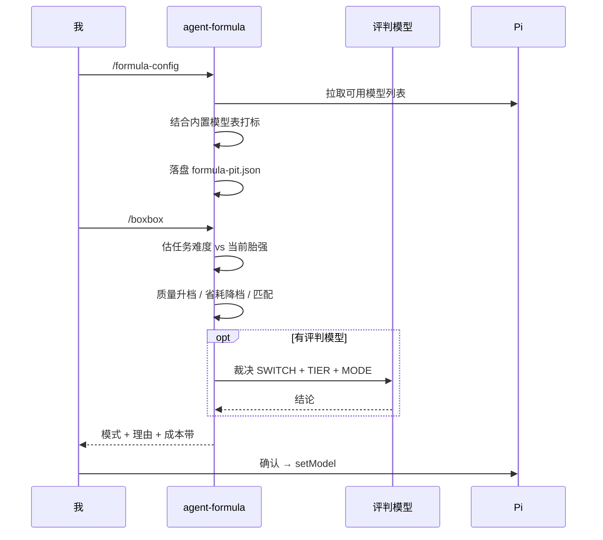

# @masonchow/pi-agent-formula

F1 主题的模型阵容与进站顾问：把可用模型按「轮胎强度」打标一次，之后一句 `/boxbox` 就知道当前该不该换模型、换哪个——**升档扛难题，降档省消耗**。

## 快速开始

```bash
pi install npm:@masonchow/pi-agent-formula
```

首次进站前先打标一次（结果写入 `~/.pi/agent/formula-pit.json`）：

```text
/formula-config
```

之后任何时候问一句：

```text
/boxbox
```

```text
## Box box! — Agent Formula
当前: deepseek/deepseek-v4-flash
是否建议换模型: 是
模式: 难度匹配（升档）
难度: hard (score=72) → 建议red胎 · 当前white胎
原因: 当前white胎偏弱，建议升到red胎
建议升档: 红胎·强但耗快 → anthropic/claude-sonnet
换模成本粗估（含 prompt cache 丢失）: …
```

省耗场景（任务变轻、当前胎过强）：

```text
模式: 省耗进站（降档）
难度: light → 建议white胎 · 当前red胎
原因: 会话平稳，可降档省额度/费用
建议降档: 白胎·省而耐 → deepseek/deepseek-v4-flash
```

只给结论，不列全档；确认后才真正 `setModel`。

## 轮胎强度

纵向按强度分三档，不需要懂 F1：

| 标签 | 昵称 | 取舍 | 适用场景 |
|------|------|------|----------|
| `red` | 红胎·强但耗快 | 很强，额度/费用消耗快 | 大重构、硬 bug、架构、连续纠错 |
| `yellow` | 黄胎·均衡 | 能力与消耗折中 | 常规开发、读改代码、联调 |
| `white` | 白胎·省而耐 | 没那么猛，更省更耐 | 小改、草稿、简单问、额度紧 |

同档横向排序：订阅优先，再比更快。

## 智能进站（难度 + 省耗）

| 模式 | 何时 | 方向 |
|------|------|------|
| **难度匹配 (match)** | `/boxbox` 时任务明显难于当前胎 | 升档 |
| **质量进站 (quality)** | 连续纠正 / 工具连失败 / 明确要求换模 | 升档 |
| **省耗进站 (economy)** | 任务偏轻且会话平稳，当前胎过强 | 降档 |

- 规则先估任务难度（关键词、文本长度、多文件线索 + 纠正/工具失败），再与当前模型胎强对比。
- 可选评判模型（judge）二次裁决，可返回 `MODE: quality|economy|match`。
- 只在手动 `/boxbox` 时评估：会话中不自动弹建议、不自动换模。

## 命令

| 命令 | 作用 |
|---|---|
| `/formula-config` | 设置评判模型 + 对全量可用模型打标（红/黄/白） |
| `/formula-tires` | 查看已配置的可选档位（红/黄/白队列） |
| `/boxbox` | 评估难度与是否过配，给结论 → 确认后 `setModel` |

## 适用范围

✅ 手动 `/boxbox`：难度匹配升档 + 质量升档 + 过配降档省耗（确认后 `setModel`）
✅ 打标时参考内置市面模型表 `src/builtin-models.json`（`power` 越大越强，`deprecated: true` 默认跳过）
✅ 换模成本评估（含 prompt cache 丢失说明）

❌ 会话中自动识别/自动弹建议（只在 `/boxbox` 时评估）
❌ 自动静默换模（始终需要确认）
❌ 每条 prompt 发前静默路由（那是路由器产品，不是进站顾问）
❌ 多 profile / 按项目分别打标
❌ 自动同步线上模型价格表（内置表按 `updated` 字段人工维护）

## 工作方式



## 配置文件

`~/.pi/agent/formula-pit.json` 保存评判模型与轮胎打标结果。想重打标直接再跑一次 `/formula-config`；想手改就直接编辑该文件。

## 许可

MIT
