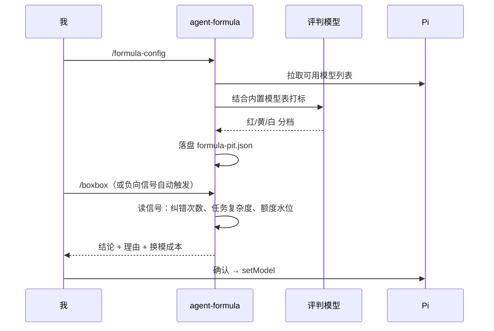

# @masonchow/pi-agent-formula

F1 主题的模型阵容与进站顾问：把可用模型按「轮胎强度」打标一次，之后一句 `/boxbox` 就知道当前该不该换模型、换哪个。

## 快速开始

```bash
pi install npm:@masonchow/pi-agent-formula
```

首次进站前先打标一次（结果写入 `~/.pi/agent/formula-pit.json`）：

```text
/formula-config
```

之后任何时候问一句：

```text
/boxbox
```

```text
Box box! 建议进站 → anthropic/claude-opus-5（红胎·强但耗快）
理由：连续 3 次纠错 + 涉及跨模块重构，当前白胎已连续两轮方向偏移
换模成本：低（上下文可延续）
[确认] 应用 setModel   [取消] 继续当前轮胎
```

只给结论，不列全档；确认后才真正 `setModel`。

## 轮胎强度

纵向按强度分三档，不需要懂 F1：

| 标签 | 昵称 | 取舍 | 适用场景 |
|------|------|------|----------|
| `red` | 红胎·强但耗快 | 很强，额度/费用消耗快 | 大重构、硬 bug、架构、连续纠错 |
| `yellow` | 黄胎·均衡 | 能力与消耗折中 | 常规开发、读改代码、联调 |
| `white` | 白胎·省而耐 | 没那么猛，更省更耐 | 小改、草稿、简单问、额度紧 |

同档横向排序：订阅优先，再比更快。

## 命令

| 命令 | 作用 |
|---|---|
| `/formula-config` | 设置评判模型 + 对全量可用模型打标（红/黄/白） |
| `/formula-tires` | 查看已配置的可选档位（红/黄/白队列） |
| `/boxbox` | 评估是否进站换模，给结论 → 确认后 `setModel` |

## 适用范围

✅ 手动 `/boxbox` 进站，也支持负向信号自动开火（量变只升温，不反复打扰）
✅ 打标时参考内置市面模型表 `src/builtin-models.json`（`power` 越大越强，`deprecated: true` 默认跳过）
✅ 换模成本评估（上下文能否延续、订阅 vs 计费）
✅ 冷却机制：刚换过不立刻再建议

❌ 自动静默换模（始终需要确认）
❌ 多 profile / 按项目分别打标
❌ 自动同步线上模型价格表（内置表按 `updated` 字段人工维护）

## 工作方式



## 配置文件

`~/.pi/agent/formula-pit.json` 保存评判模型与轮胎打标结果。想重打标直接再跑一次 `/formula-config`；想手改就直接编辑该文件。

## 许可

MIT
