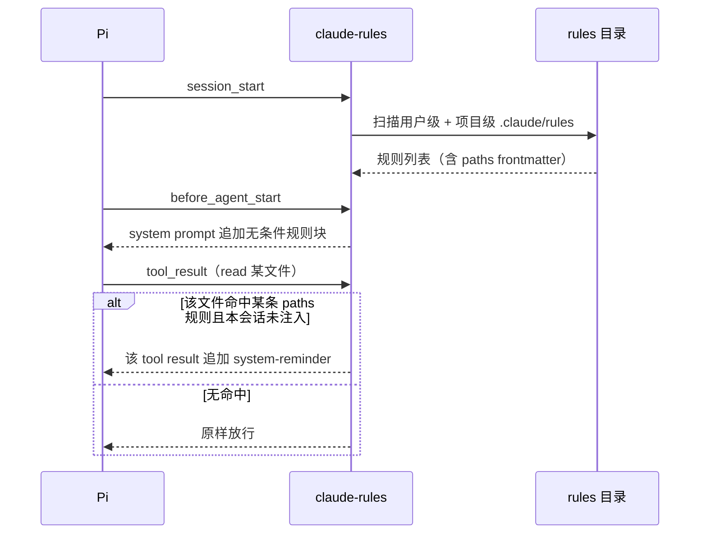

# @masonchow/pi-claude-rules

让 Pi 按 Claude Code 的语义消费 `.claude/rules/`：无条件规则挂 system prompt，带 `paths` 的规则等 agent 读到匹配文件时才注入。同一套规则库，Claude Code 和 Pi 表现一致。

## 快速开始

```bash
pi install npm:@masonchow/pi-claude-rules
```

已有 `~/.claude/rules/` 或项目内 `.claude/rules/` 的话，重启 Pi 即生效：

```text
claude-rules: 3 unconditional + 8 path-scoped rule(s) loaded
```

`/rules` 查看当前加载状态：

```text
[user] ~/.claude/rules/typescript.md — paths: **/*.ts, **/*.tsx [injected]
[user] ~/.claude/rules/readme-writing.md — always
[project] .claude/rules/api-contract.md — paths: src/api/**
```

`[injected]` 表示本会话已因 read 命中而注入过。

## 规则文件写法

无条件规则——每次 agent 启动都注入：

```markdown
# 提交规范
所有 commit message 使用中文祈使句。
```

按路径生效的规则——只在 agent 读到匹配文件时注入到那次 tool result：

```markdown
---
paths: "src/**/*.ts, tests/**/*.ts"
---

# TS 约定
禁止 any，外部数据用 unknown + 类型守卫收窄。
```

`paths` 支持逗号分隔字符串、YAML 列表、内联数组三种写法。

## 适用范围

✅ 用户级 `~/.claude/rules/` + 项目级 `<project>/.claude/rules/`（从 cwd 逐级向上查找），递归扫描 `.md`
✅ glob：`**`、`*`、`?`、`{a,b}`、`[...]`；symlink 路径与 realpath 双路径匹配
✅ 目录与文件 symlink 均解析，循环 symlink 跳过，realpath 去重
✅ 与 Pi 内建 contextFiles（`AGENTS.md` / `CLAUDE.md`）按 realpath 去重，不重复注入
✅ 注入顺序：用户级先、项目级后（项目优先级更高），同级字典序
✅ compact 后 path-scoped 规则可重新触发

❌ Claude Code 文档未定义的触发方式（只有 `read` 触发；write / edit 不触发）
❌ 规则内容的模板变量、条件表达式、include
❌ 无效括号表达式的 glob（静默不匹配，对齐 Claude Code v2.1.207 行为）

## 工作方式



## 为什么这样注入

- 无条件规则挂 **system prompt**：会话内字节稳定，compact 之后天然存活，且不会每轮重写缓存前缀。
- path-scoped 规则走 **tool result**：消息落库前修改，append-only，不回写历史。

两条不变量共同保证扩展对 Anthropic prompt cache 中性：注入内容在会话内字节稳定（规则只在 `session_start` 读盘一次、确定性排序渲染），且从不回改历史消息。改动前先确认没破坏这两条。

## 许可

MIT
