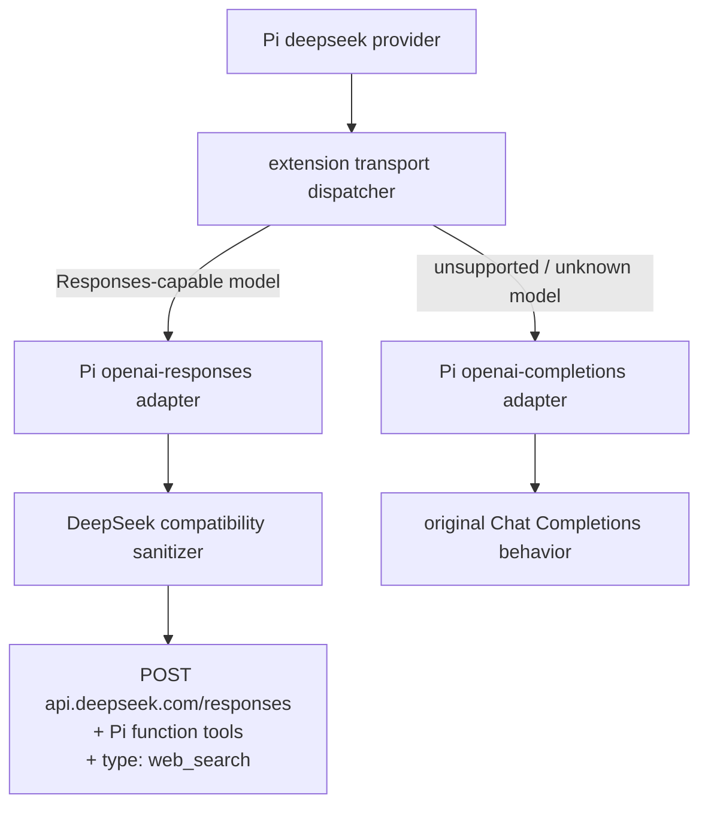

# @masonchow/pi-deepseek-responses

把 **已支持 Responses API 的 Pi 官方 DeepSeek 模型**透明切到 DeepSeek Responses API，并默认启用 DeepSeek 官方 server-side `web_search`。尚未支持 Responses 的 DeepSeek 模型继续使用 Pi 原来的 Chat Completions transport。

安装后继续正常选择原 provider/model：

```bash
pi install npm:@masonchow/pi-deepseek-responses
pi --provider deepseek --model deepseek-v4-flash
```

链路：



## 为什么这样实现

Pi 当前内置 DeepSeek 使用 `openai-completions`。这个扩展通过 `registerProvider("deepseek", { streamSimple })` 覆盖 transport dispatcher，同时继续复用 Pi 自带的：

- DeepSeek model catalog
- `DEEPSEEK_API_KEY` / `/login` 鉴权
- context window / max tokens / cost metadata
- `/model` 选择行为

对已确认支持 Responses 的模型，扩展内部调用 Pi 自带的 `openai-responses` adapter；其他模型委托回 Pi 原 `openai-completions` adapter。这样无需维护第二份 DeepSeek 模型清单，也不会因为安装扩展破坏仍依赖 Chat Completions 的模型。

## 图片输入

DeepSeek 官方模型已原生支持多模态，本扩展不再做识图模型切换。唯一保留的处理是：Pi 0.84.1 的 DeepSeek catalog 仍把 `deepseek-v4-flash` / `deepseek-v4-pro` 的 `input` 标成纯 `text`，adapter 会在发请求前把图片降级成 `(image omitted: ...)` 占位文本，所以扩展在 Responses 路径上补声明 `input: ["text", "image"]`，让贴图与 `read` 读到的图原样发到 `/responses`。

Pi 官方 catalog 更新 `input` 之后这行补丁可以删掉。

## Web Search

Responses-capable DeepSeek 模型默认自动追加：

```json
{ "type": "web_search" }
```

Pi 原有 function tools 会原样保留，例如 `read`、`bash`、`edit` 和其他 extension tools。

关闭自动搜索注入：

```bash
export PI_DEEPSEEK_WEB_SEARCH=0
```

此时 Responses-capable DeepSeek 模型仍走 `/responses`，只关闭本扩展追加的 `web_search`。未支持 Responses 的模型仍走原 Chat Completions transport。

## DeepSeek Responses 兼容层

Pi 的 OpenAI Responses adapter 会生成一些 DeepSeek 当前不支持的 OpenAI-specific 字段。扩展在发送前移除这些字段，例如：

- `store`
- `include`
- `prompt_cache_key`
- `prompt_cache_retention`
- `prompt_cache_options`
- `service_tier`
- `previous_response_id`
- `conversation`

`reasoning` 只保留 DeepSeek 当前有效的 `effort`。

DeepSeek 自己管理上下文缓存，因此扩展会把 Pi 的 Responses cache retention 设为 `none`，避免生成 OpenAI prompt-cache 参数。

## 当前模型支持

DeepSeek 按「代际 + 档位」开放 Responses 能力，并提供指向最新代际的无版本别名。扩展用模式匹配判定：

```
/^deepseek-(?:v\d+-)?(?:flash|pro)$/
```

| model id | 走哪条 transport |
|---|---|
| `deepseek-v4-flash` / `deepseek-v4-pro` | `/responses` + native `web_search` |
| `deepseek-flash` / `deepseek-pro`（无版本别名） | `/responses` + native `web_search` |
| 未来代际 `deepseek-v5-flash` 等 | `/responses` + native `web_search`（不用改代码） |
| `deepseek-chat` / `deepseek-reasoner` 等旧模型 | Pi 原 Chat Completions transport |
| 其他未知 DeepSeek 模型 | Pi 原 Chat Completions transport |

之前这里是一份硬编码 model id allowlist，每出一个别名就得改代码发版。改成模式匹配后新别名自动覆盖；代价是若 DeepSeek 发布了匹配该模式但服务端尚未开放 `/responses` 的模型，会走到 Responses 路径失败——真出现时把该 id 加进模式的排除项即可。

> 无版本别名（如 `deepseek-flash`）目前不在 Pi 0.84.1 的内置 catalog 里，`/model` 选不到。要用得先在 `~/.pi/models.json` 的 `deepseek` provider 下补一条同 id 的模型定义（models.json 层与内置 catalog 是**合并**语义，不会顶掉 `deepseek-v4-flash` / `deepseek-v4-pro`）。

## 调试

```bash
export PI_DEEPSEEK_RESPONSES_DEBUG=1
```

Responses 路径：

```text
[pi-deepseek-responses] provider=deepseek model=deepseek-v4-flash api=openai-responses web_search=enabled
[pi-deepseek-responses] request tools=function,function,web_search
```

Fallback 路径（未知 / 尚未开放 Responses 的模型）：

```text
[pi-deepseek-responses] provider=deepseek model=future-model api=openai-completions responses=unsupported
```

不会打印 API key 或完整 prompt。

## 已知限制

Pi 当前 `openai-responses` parser 会忽略 provider-specific `web_search_call` transcript item。单轮搜索与最终文本输出可以正常工作；需要原样 replay `web_search_call` 来恢复完整搜索上下文的多轮场景，仍需要后续扩展 parser/session 持久化能力。

这个限制也是 Pi maintainer 暂不把 server-side tools 做成 core 通用抽象的主要原因之一。

Pi 的 `read` 工具按 catalog 里的 `input` 判断模型是否收图，catalog 仍标 text-only 时会在 `toolResult` 文本里附一句 `[Current model does not support images. The image will be omitted from this request.]`。本扩展在 transport 层补了 `input`、图片实际发得出去，所以这句提示是对 LLM 的误导性噪音。要消掉它得等 Pi 官方 catalog 更新。

## 本地开发

```bash
cd pi-deepseek-responses
npm install
npm test
npm run typecheck

# 建议用本包 peer 对应的 Pi 版本（当前 0.84.1）
./node_modules/.bin/pi -e ./src/index.ts --provider deepseek --model deepseek-v4-flash
```

实现依赖 Pi extension loader 暴露的 `@earendil-works/pi-ai/compat` stream helpers（`streamSimpleOpenAIResponses` / `streamSimpleOpenAICompletions`）。**不要**从 `@earendil-works/pi-ai/api/*` 子路径导入——jiti 会把该路径错误拼到 `compat.js` 上导致扩展加载失败。

真实 API smoke（已在 Pi 0.84.1 + DeepSeek 账号验证）：

```bash
PI_DEEPSEEK_RESPONSES_DEBUG=1 \
  ./node_modules/.bin/pi -e ./src/index.ts --provider deepseek --model deepseek-v4-flash \
  -p --no-session --no-tools \
  "搜索今天 Pi coding agent 的最新版本变化，并给出来源"

PI_DEEPSEEK_RESPONSES_DEBUG=1 \
  ./node_modules/.bin/pi -e ./src/index.ts --provider deepseek --model deepseek-v4-pro \
  -p --no-session --no-tools \
  "搜索今天 Pi coding agent 的最新版本变化，并给出来源"

# 图片输入（需要 tools，让模型用 read 读图）
PI_DEEPSEEK_RESPONSES_DEBUG=1 \
  ./node_modules/.bin/pi -e ./src/index.ts --provider deepseek --model deepseek-v4-flash \
  -p --no-session \
  "只做一件事：用 read 工具读取 /tmp/some.png，然后回答图片内容。禁止使用 bash。"
```

期望 debug 行：

```text
# flash
api=openai-responses web_search=enabled
# pro
api=openai-responses web_search=enabled
```

Responses + `web_search` 路径已在 Pi 0.84.1 + DeepSeek 账号实测。去掉识图切换后的图片输入路径尚未实跑验证，只跑过单测与 typecheck。
