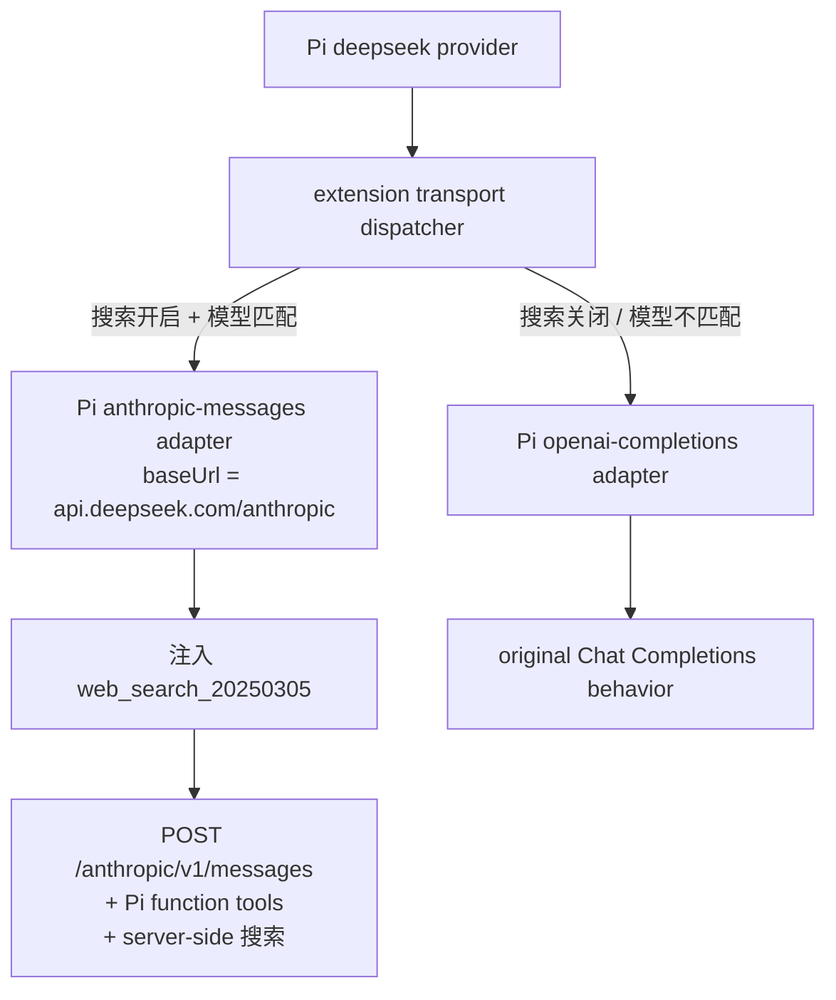

# @masonchow/pi-deepseek-responses

给 Pi 的官方 DeepSeek 模型接上 **DeepSeek 原生的 server-side 联网搜索**——模型自己发起搜索、自己读页面、自己汇总，客户端不需要任何搜索 API。

```bash
pi install npm:@masonchow/pi-deepseek-responses
pi --provider deepseek --model deepseek-flash
```

问一句需要实时信息的话即可验证：

```
> 北京现在的实时温度是多少？
北京当前实时温度约 29℃（不同数据源略有差异，多在 28–29℃ 之间）。
```

## 适用范围

✅ `deepseek-flash`、`deepseek-v4-pro`，以及未来的 `deepseek-v5-flash` 等新代际（模式匹配自动覆盖）
✅ Pi 的全部 function tools（`read` / `bash` / `edit` / 其他扩展工具）与搜索共存
✅ 图片输入、thinking / reasoning effort

❌ `deepseek-chat` / `deepseek-reasoner` / `deepseek-v4-flash-vision-exp` 等——保持 Pi 原有 Chat Completions 行为，不受影响
❌ 非官方 DeepSeek provider（openrouter 等）

## 为什么绕到 Anthropic 端点

DeepSeek 有两个 API 端点，**server-side 搜索只存在于 Anthropic 兼容的那个**：

| 端点 | 协议 | web_search |
|---|---|---|
| `api.deepseek.com/responses` | OpenAI Responses | ❌ 官方兼容表标为 **Ignored** |
| `api.deepseek.com/v1/chat/completions` | OpenAI Completions | ❌ 只有客户端 `function` 工具 |
| `api.deepseek.com/anthropic` | Anthropic Messages | ✅ `server_tool_use` + `web_search_tool_result` |

Responses 端点会**解析** `{"type":"web_search"}`（响应里照样回显它、补全 `search_context_size` 和 `user_location`），但**不执行**——没有 `web_search_call`、没有 annotations，模型最多吐一段裸文本 `<tool_call>`。这是个静默的空操作，光看请求有没有报错查不出来。

所以搜索开启时，扩展把 transport 换成 Pi 自带的 `anthropic-messages` adapter，并把 baseUrl 指到 `/anthropic`：



外层 provider 始终是 `deepseek`，所以 Pi 自带的 model catalog、`DEEPSEEK_API_KEY` / `/login` 鉴权、cost metadata、`/model` 选择行为全部不变——扩展只换协议和 base URL。

> 包名里的 `responses` 是历史遗留：早期版本走的是 `/responses`。改包名会断掉已安装用户的 package 路径，收益不值，故保留。

## 模型判定

```
/^deepseek-(?:v\d+-)?(?:flash|pro)$/
```

用模式匹配而不是硬编码 allowlist：Pi 的模型列表来自 pi.dev 远程 catalog overlay（每 4 小时刷新并与内置 catalog 合并），新模型随时会出现，写死的清单永远追不上。

代价是模式可能跑在服务端前面——若 DeepSeek 发布了匹配该模式但尚未开放搜索的模型，会走到 Anthropic 端点失败。真出现时加排除项即可。

## 关闭搜索

```bash
export PI_DEEPSEEK_WEB_SEARCH=0
```

此时**连 Anthropic 端点也不走**，直接回落 Pi 原生的 Chat Completions——绕路的唯一目的就是搜索，没有搜索就没有绕路的理由。

值得关的场景：server-side 搜索每次会把检索到的网页内容塞进上下文，实测一次两轮搜索的请求 input_tokens 约 18k，纯代码任务开着它是白烧钱。

## 调试

```bash
export PI_DEEPSEEK_RESPONSES_DEBUG=1
```

搜索路径：

```text
[pi-deepseek-responses] provider=deepseek model=deepseek-flash api=anthropic-messages web_search=enabled
[pi-deepseek-responses] request tools=function,function,...,web_search_20250305
```

回落路径：

```text
[pi-deepseek-responses] provider=deepseek model=deepseek-flash api=openai-completions web_search=disabled
[pi-deepseek-responses] provider=deepseek model=future-model api=openai-completions model=unsupported
```

不会打印 API key 或完整 prompt。

## 已知限制

DeepSeek 的 Anthropic 兼容层会静默忽略部分请求字段（`top_k`、`service_tier`、`container`、`mcp_servers`），`thinking.budget_tokens` 也被忽略——都不报错，所以扩展不做字段清洗。`metadata` 只认 `user_id`。

搜索结果里的 `encrypted_content` 只有模型在 session 内能解密，客户端侧只看得到 title 和 url，这是 Anthropic 的设计，DeepSeek 照搬了。

## 本地开发

```bash
cd pi-deepseek-responses
npm install
npm test
npm run typecheck
```

实现依赖 Pi extension loader 暴露的 `@earendil-works/pi-ai/compat` stream helpers（`streamSimpleAnthropic` / `streamSimpleOpenAICompletions`）。**不要**从 `@earendil-works/pi-ai/api/*` 子路径导入——jiti 会把该路径错误拼到 `compat.js` 上导致扩展加载失败（有单测守着这条）。

真实 API smoke（已在 Pi 0.85.1 + DeepSeek 账号验证）：

```bash
# 搜索路径：应返回真实实时数据
PI_DEEPSEEK_RESPONSES_DEBUG=1 pi --provider deepseek --model deepseek-flash \
  -p --no-session --no-tools "北京现在的实时温度是多少？一句话回答"

# 回落路径：应打印 api=openai-completions
PI_DEEPSEEK_WEB_SEARCH=0 PI_DEEPSEEK_RESPONSES_DEBUG=1 pi --provider deepseek \
  --model deepseek-flash -p --no-session --no-tools "只回复两个字：收到"

# function tools 与搜索共存：应看到 tools=function,...,web_search_20250305
PI_DEEPSEEK_RESPONSES_DEBUG=1 pi --provider deepseek --model deepseek-flash \
  -p --no-session "用 read 工具读取 /tmp/note.txt 并复述内容。禁止用 bash。"
```
