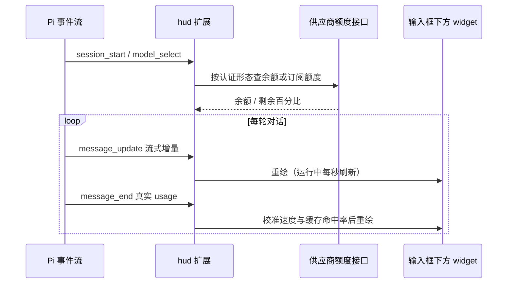

# @masonchow/pi-hud

给 Pi 输入框下方加一条 Claude Code statusline 风格的 HUD：当前模型、上下文水位、额度/花费、缓存命中率、subagent 消耗，一眼看完。

## 快速开始

```bash
pi install npm:@masonchow/pi-hud
```

重启 Pi 后 HUD 自动渲染在输入框下方，会话内用 `/hud` 开关。

```text
λ opencode-go/deepseek-v4-flash │ 订阅 5h 剩 100% (重置 4h52m) · 周 剩 100% · 月 剩 100%
⊡ ██████░░░░ 62.4% 124.8k/200k │ ⏱ 4m18s │ ⚡ 43 tok/s │ ⛁ cache 78% │ ↑312.5k ↓18.2k
↳ scout claude-sonnet-5 ↑42.1k ↓3.8k $0.031 ×2
```

第 3 行只在本会话跑过 subagent 时出现。

## 适用范围

✅ 主模型 provider/model + 认证形态（订阅 / API key）
✅ 上下文水位进度条（来自 `ctx.getContextUsage()`，≥70% 转黄、≥85% 转红）
✅ 累计活跃时长、流式 token 输出速度（`message_end` 后用真实 usage 校准）
✅ 缓存命中率 `cacheRead / (input + cacheRead + cacheWrite)`
✅ subagent 逐个列出模型 / tokens / 成本，按 runId 去重
✅ 订阅额度：`openai-codex`（含剩余百分比与重置倒计时）
✅ 订阅额度：`opencode-go`（5h / 周 / 月三窗口；官方 API 优先，否则 dashboard scrape）
✅ API key 余额：deepseek / kimi / stepfun（其余供应商无查询 API，只显示本次花费）

❌ 自定义布局、字段开关、主题配置（只有 `/hud` 一个开关）
❌ 跨会话历史统计、成本报表导出
❌ 未提供余额 / 额度查询 API 的供应商（opencode-go 除外，见下）

## OpenCode Go 额度

`opencode-go` 在 auth 里是 api_key，但产品是订阅额度（5h $12 / 周 $30 / 月 $60）。

查询顺序：

1. **官方** `GET https://opencode.ai/zen/go/v1/usage` + Bearer API key（上游上线后自动生效）
2. **Dashboard scrape** `https://opencode.ai/workspace/{id}/go`（当前可用）

Scrape 凭据解析（后者仅补齐前者缺失字段）：

| 来源 | 说明 |
|------|------|
| `~/.pi/agent/opencode-go-quota.json` | `{ "workspaceId", "authCookie" }` 手动覆盖 |
| 环境变量 | `OPENCODE_GO_WORKSPACE_ID` / `OPENCODE_GO_AUTH_COOKIE` |
| opencode-quota 配置 | `~/.config/opencode/opencode-quota/opencode-go.json` |
| macOS Chrome 自动 | History 抽 `wrk_*`，Cookies 解 `auth`（需本机已登录 opencode.ai） |

显示 `额度 ✗` 时：确认 Chrome 已登录 [opencode.ai/workspace](https://opencode.ai/workspace)，或写入上述 json。首次读 Keychain 可能弹一次权限框。

## 工作方式



只读事件流做 UI 渲染，不注入 system prompt、不回写对话历史，因此对 prompt cache 完全中性。

## 隐私与成本

- 额度查询只发往当前登录供应商自己的接口，凭据经 Pi 的 `AuthStorage` 读取，不落日志。
- HUD 不增加任何模型调用，不产生 token 费用。
- `↑` 是 input + cacheRead + cacheWrite 之和，用于估算真实计费量，不等于新增 input。

## 许可

MIT
